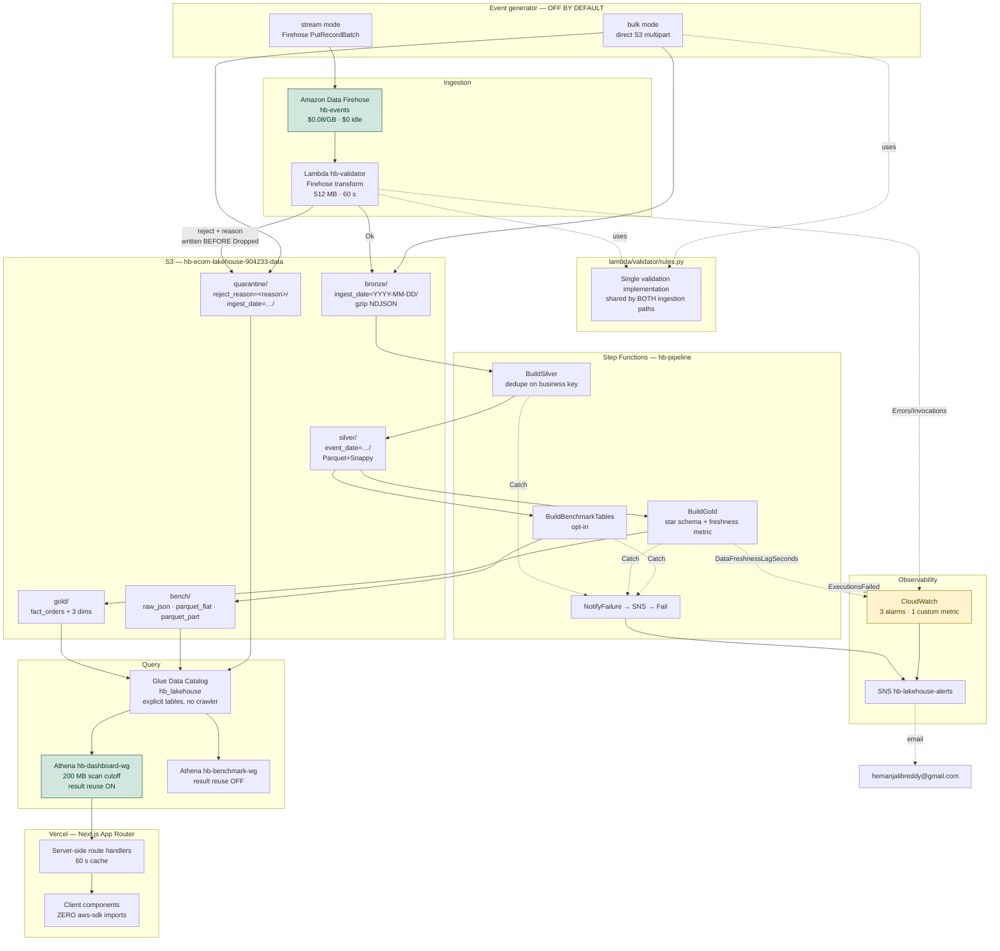

# Architecture

**hb-ecommerce-lakehouse** — Hemanjali Buchireddy
AWS account 904233128322 · us-east-1

A serverless e-commerce lakehouse: streaming ingestion with in-flight schema
validation, a medallion pipeline (bronze → silver → gold), a Kimball star schema
queryable from Athena, and a Next.js observability dashboard on Vercel.

The design constraint that shaped every decision below was a **$5/month hard
ceiling with no free tier**. Every service choice was priced from the AWS Pricing
API before being adopted, and the resulting idle cost is **$0.77/month**.

---

## System diagram

**Legend.** Green = an active cost guard (Firehose has no idle charge; the
dashboard workgroup enforces a hard per-query scan cutoff). Amber = the only
component with a standing monthly charge.

---

## Data flow in one paragraph

The generator produces synthetic e-commerce events with deliberate defects —
about 2% malformed and 5% backdated. Both ingestion paths validate against
`rules.py`: valid records land in `bronze/` partitioned by ingest date, rejects
land in `quarantine/` partitioned by rejection reason, **written before the
record is dropped from the stream**. Step Functions then runs Glue PySpark jobs
that deduplicate on the business key into `silver/`, build a Kimball star schema
into `gold/`, and (on request) materialise three physical layouts of the same
rows into `bench/` for the Phase 2 measurement. Athena queries the gold layer
through explicit Glue Catalog tables. A Next.js dashboard reads it all through
server-side route handlers using a dedicated read-only IAM user.

---

## Architecture Decision Records

### ADR-001 — AWS Glue over Amazon EMR

**Status:** Accepted

**Context.** The pipeline needs distributed Spark to deduplicate, type-enforce
and reshape a few million rows into a star schema. Both Glue and EMR run Spark.

**Decision.** AWS Glue, with `execution_class = FLEX`.

**Rationale.**
- **Idle cost is the whole argument.** EMR bills per instance-hour for the
  cluster's entire lifetime, including the minutes it spends bootstrapping and
  idling. Glue bills per DPU-second with a 1-minute minimum and nothing between
  runs. For a pipeline that runs for four minutes a day, EMR's model is wrong at
  a structural level, not merely more expensive.
- Glue Flex is **$0.29/DPU-hour** against standard Glue's $0.44 (both verified
  from the Pricing API) — a 34% saving for batch work with no deadline.
- No cluster to size, patch, or forget to terminate. A forgotten EMR cluster is
  the single most common way a portfolio project generates a surprise bill.
- The Glue Data Catalog is already the metastore Athena reads, so there is no
  separate Hive metastore to run.

**Consequences.**
- Less control over Spark configuration and no ability to use custom AMIs or
  install arbitrary system packages.
- Flex jobs can sit queued before starting. This directly shaped the
  orchestration: **there is no task-level timeout in the state machine**, because
  a timeout would fire while a job was still queued and the retry would
  double-execute. The timeout lives on the Glue job, whose clock excludes queue
  time.
- Job bookmarks are unavailable on Flex. Acceptable here because each run fully
  overwrites silver and gold.

**Rejected because:** at this data volume EMR's flexibility buys nothing and its
billing model costs everything.

---

### ADR-002 — Parquet over ORC

**Status:** Accepted

**Context.** Curated layers need a columnar, compressed, splittable format.
Parquet and ORC are both credible; both support predicate pushdown, column
pruning and Snappy.

**Decision.** Snappy-compressed Parquet throughout.

**Rationale.**
- **Ecosystem fit.** Athena, Glue, Spark, pandas, DuckDB and every BI tool read
  Parquet natively. ORC's best support is in the Hive/Tez lineage, which this
  stack does not use.
- Spark's Parquet writer is its most exercised path; ORC support exists but is
  less travelled.
- Snappy over gzip deliberately: gzip compresses ~20-30% better but is
  **not splittable**, so a single large gzip file cannot be read in parallel.
  Snappy trades compression ratio for parallelism, which is the right trade when
  the bottleneck is scan throughput.

**Consequences.** Slightly larger files than ORC with ZLIB would produce. At the
storage prices involved (~$0.06/month) that difference is immaterial, and the
portability is worth far more.

**Honest note.** ORC often edges out Parquet on compression ratio and on
predicate pushdown for string-heavy data. Had this pipeline targeted Hive on
Tez, ORC would have been the better answer. It targets Athena, so Parquet wins.

---

### ADR-003 — Kinesis Data Streams vs direct S3 writes

**Status:** Accepted — and, unusually, **measured rather than assumed**

**Context.** Events must reach S3. Three options: Kinesis Data Streams → Firehose
→ S3; Firehose alone; or the producer writing to S3 directly.

**Decision.** **Firehose for the live path, direct S3 writes for the bulk
benchmark corpus.** No Kinesis Data Streams.

**Rationale.** Prices verified from the AWS Pricing API on 2026-07-31:

| Option | Per-unit | **Idle cost** |
|---|---|---|
| KDS provisioned | $0.015/shard-hour | **$10.80/month** |
| KDS on-demand | $0.040/stream-hour + $0.08/GB | **$28.80/month** |
| **Firehose** | **$0.080/GB** | **$0.00** |
| Direct S3 PUT | $0.005/1,000 requests | **$0.00** |

KDS buys multi-consumer fan-out, 24-hour to 365-day replay, and per-shard
ordering. This pipeline has **one consumer and one destination** and needs none
of them. At a $5/month ceiling, a provisioned KDS stream would consume more than
twice the entire budget before ingesting a single record.

Direct S3 writes are cheaper still, but they bypass the transform Lambda —
meaning no in-flight validation, no quarantine, and one object per producer flush
rather than a buffered, sensibly-sized object. Firehose's buffering (5 MB / 60 s)
is doing real work: it is what prevents the small-file problem that would
otherwise dominate Athena scan times.

**Because both paths are implemented, this ADR cites measurements rather than
speculation.** Bulk mode reuses `rules.py`, so it validates identically and
writes to the same quarantine prefix — the only thing it skips is Firehose's
buffering and the $0.08/GB.

**Consequences.**
- No replay. If the transform Lambda has a bug, records already delivered to
  bronze must be reprocessed from bronze rather than replayed from the stream.
  Acceptable because bronze *is* the durable raw record.
- Firehose's minimum 60-second buffer puts a floor on end-to-end latency. This
  is a batch analytics platform, so seconds do not matter.

---

### ADR-004 — Step Functions over Apache Airflow

**Status:** Accepted

**Context.** The batch path needs orchestration with retries, exponential
backoff, a failure branch and run history the dashboard can read.

**Decision.** AWS Step Functions, Standard workflows.

**Rationale.**
- **Airflow needs a server that never sleeps.** Self-managed means an EC2
  instance or ECS service running 24/7; MWAA's smallest environment is billed
  per-hour continuously. Either is an order of magnitude over the entire budget
  for a pipeline that executes for four minutes a day.
- Step Functions Standard bills **$0.000025 per state transition**. At ~20
  transitions per run that is **$0.0005** — and exactly $0 when not running.
- Retries with exponential backoff, `Catch` branches and `Choice` states are
  declarative primitives, not code to maintain.
- 90 days of execution history is queryable through the API, which is precisely
  what the dashboard's "last pipeline run" panel reads. No extra database.

**Consequences.**
- Amazon States Language is markedly less expressive than Python. Complex
  branching gets verbose fast, and the JSON is harder to unit-test than an
  Airflow DAG.
- No rich scheduler semantics: no backfills, no `catchup`, no cross-DAG
  dependencies. EventBridge covers plain cron if needed.
- Vendor lock-in. An Airflow DAG is portable across clouds; a state machine is
  not. Accepted deliberately — this project is explicitly an AWS-native design.

**Chosen over Express workflows** because Express bills per GB-second and keeps
no queryable execution history, so the dashboard would need CloudWatch Logs
Insights to reconstruct what Standard gives away.

---

## Cost architecture

The full list of resources that bill while completely idle:

| Resource | Monthly |
|---|---|
| 4 CloudWatch alarm-metrics @ $0.10 | $0.40 |
| 1 custom metric `DataFreshnessLagSeconds` | $0.30 |
| S3 storage (~2.5 GB) | $0.06 |
| **Total idle** | **$0.77** |

Everything else — Firehose, Lambda, Glue, Step Functions, Athena — is strictly
pay-per-use and costs exactly $0.00 when nothing runs. `terraform destroy`
returns the account to $0.00.

Guards, in order of how fast they act:

1. **Athena workgroup scan cutoff (200 MB)** — instant and hard. Athena refuses
   the query before scanning. This is what stops a recruiter refreshing the
   dashboard from generating a bill.
2. **Generator off by default** — no data moves unless invoked by hand.
3. **`make demo-down`** — empties buckets and disables alarms.
4. **60-second server-side cache** on every dashboard Athena call.
5. **AWS Budget at $5** — a backstop, not a guard: Budgets evaluate *actual*
   spend and lag by hours.

## Deliberate non-goals

- **OpenSearch.** $25.92/month per node, always on, for log search this project
  does not need. CloudWatch Logs Insights at $0.005/GB scanned covers it.
- **QuickSight.** Starts a per-user monthly subscription. The Vercel dashboard
  is the deliverable.
- **A Glue Crawler.** Bills a 10-minute minimum per crawl, and crawler-created
  tables are not in Terraform state so they survive `terraform destroy`.
- **S3 versioning.** Every noncurrent version bills at full rate, and the
  pipeline overwrites silver and gold on every run.
- **KMS.** $1/month per key plus per-request charges, protecting synthetic data
  against a threat already covered by the public access block.
