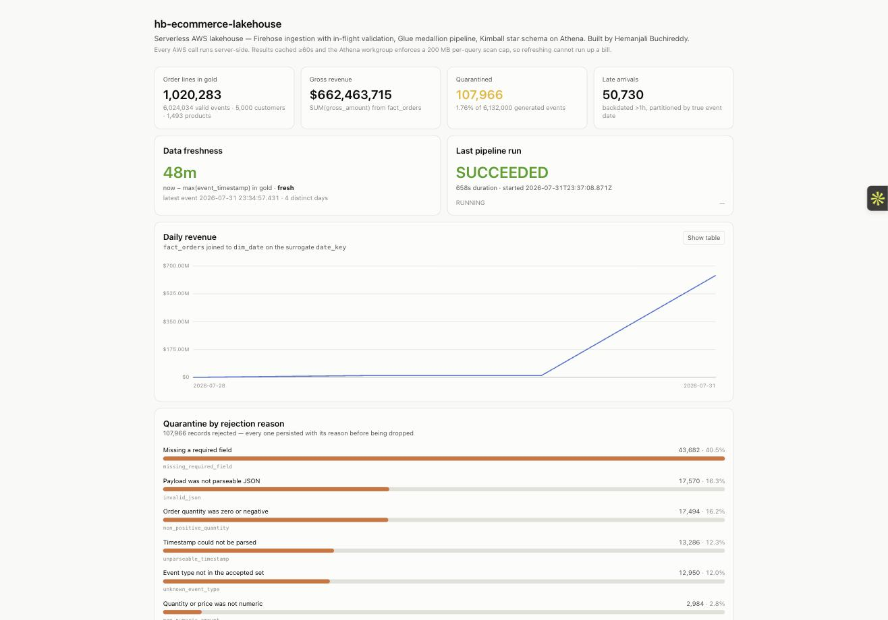
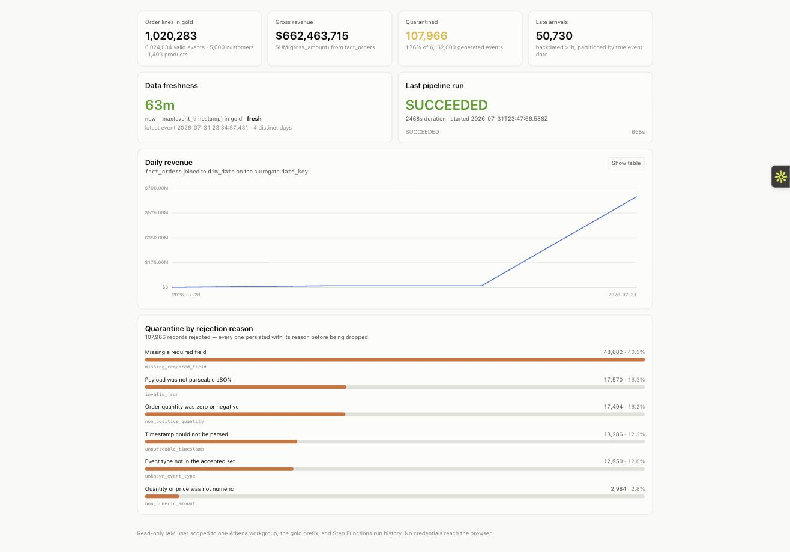

# hb-ecommerce-lakehouse

**Hemanjali Buchireddy**

An end-to-end serverless data platform on AWS: streaming ingestion with in-flight
schema validation, a medallion pipeline (bronze → silver → gold), a Kimball star
schema queryable from Athena, and a Next.js observability dashboard on Vercel.

Everything is Terraform. Nothing was clicked into existence in the console.

**Built under a $5/month hard ceiling with no free tier.** Idle cost is
**$0.77/month**; `terraform destroy` returns the account to $0.00.

| | |
|---|---|
| **Live dashboard** | **https://hb-lakehouse-dashboard.vercel.app** |
| **Architecture + ADRs** | [ARCHITECTURE.md](ARCHITECTURE.md) |
| **Measured benchmark** | [BENCHMARK.md](BENCHMARK.md) |
| **IAM design** | [IAM_DESIGN.md](IAM_DESIGN.md) |
| **Cost model** | [COST_ESTIMATE.md](COST_ESTIMATE.md) |
| **Resume bullets** | [RESUME_BULLETS.md](RESUME_BULLETS.md) |

## Measured results

| | |
|---|---|
| Rows through the pipeline | **6,024,034** |
| Order lines in `fact_orders` | **1,020,283** across 5,000 customers and 1,493 products |
| Quarantined | **107,966 of 6,132,000** (1.76%) across 6 rejection reasons, **0** write failures |
| Late arrivals correctly partitioned by event date | **50,730** |
| Bytes scanned, raw JSON → Parquet | **1.47 GiB → 6.05 MB (248× less)** |
| Cost per analytical query | **$0.007163 → $0.000048 (149× less)** |
| Total build cost (measured) | **$0.21** |
| Idle cost | **$0.77/month** |

---

## Screenshots





---

## What it does

```
generator ──► Firehose ──► validator Lambda ──► bronze/  (valid)
                                └────────────► quarantine/reject_reason=…/  (invalid, with reason)

Step Functions ──► Glue silver (dedupe on business key, typed)
                     └► Glue gold (fact_orders + dim_customer/product/date)
                          └► Glue bench (3 layouts of the same rows, for measurement)

Athena ──► Next.js dashboard on Vercel (server-side only)
```

The generator deliberately emits **~2% malformed** and **~5% late-arriving**
records. Malformed records are never silently discarded: they are written to a
reason-partitioned quarantine prefix *before* being dropped from the stream, and
if that write fails the record is returned as `ProcessingFailed` so Firehose
keeps it. Late arrivals are not errors — they are partitioned by their true
`event_date`, which is exactly why the pipeline partitions on event date rather
than ingest date.

---

## Prerequisites

| Tool | Version used | Notes |
|---|---|---|
| Terraform | 1.15.8 | `brew install hashicorp/tap/terraform` — the formula was removed from homebrew-core when HashiCorp moved to BSL |
| AWS CLI | 2.28.21 | configured with a named profile |
| Python | 3.13 | a project-local `.venv` is created by `make venv` |
| Node.js | 25.x | dashboard only |
| Vercel CLI | 54.x | dashboard only |

Docker is **not** required. The Lambda is packaged as a plain zip using only the
standard library plus the runtime's bundled boto3.

---

## Setup

### 1. Credentials

```bash
aws configure --profile hb     # access key, secret, us-east-1, json
aws sts get-caller-identity --profile hb
```

Expect `arn:aws:iam::904233128322:user/hb-builder`.

> The build user runs on a scoped policy, not `AdministratorAccess`. See
> [IAM_DESIGN.md](IAM_DESIGN.md). Every `make` target that touches AWS runs
> `guard-account` first and refuses to proceed if the resolved account is wrong —
> this machine has a second AWS profile pointing at a different account.

### 2. Budget first

The $5 budget is created **before any billable resource**, and every chargeable
resource carries `depends_on = [aws_budgets_budget.ceiling]` so a fresh apply
into an empty account cannot invert that ordering.

```bash
make plan     # creates nothing
make apply    # first spend
```

### 3. Confirm the alert email

SNS subscriptions stay `PendingConfirmation` until the link is clicked —
Terraform cannot confirm them.

```bash
make confirm-sns
```

### 4. Load data (off by default — nothing runs on its own)

```bash
make generate-bulk TARGET_GB=2          # benchmark corpus, direct to S3
make generate-stream RATE=200 DURATION=60   # live path, through Firehose
```

### 5. Run the pipeline

```bash
make run-pipeline          # bronze -> silver -> gold
make run-pipeline-bench    # also rebuild the three benchmark tables
make status                # run history, object counts, month-to-date spend
```

### 6. Measure

```bash
make benchmark             # writes BENCHMARK.md from real Athena statistics
```

---

## Teardown

```bash
make demo-down   # empty buckets + disable alarms  -> ~$0.00/month, infra intact
make destroy     # remove everything               -> $0.00/month
```

`make destroy` is designed to work in one command because every bucket is
`force_destroy` and the Glue tables are declared in Terraform rather than created
by a crawler — a crawler-created table is not in state and would survive the
destroy.

> **Verification status, stated honestly.** `make guard-account` has been run and
> works. **`make demo-down` and `make destroy` have NOT been executed**, because
> doing so would tear down the live dashboard this README links to. They are
> written and reviewed but unverified. Run `make demo-down` first — it is
> reversible (it empties buckets and disables alarms; `make apply` plus a
> regeneration restores everything) — before trusting `make destroy`.

> **Do not use `terraform apply -target`.** During this build a targeted apply
> pruned three resources from state, and the next plan proposed recreating
> buckets that already existed. Recovered from `terraform.tfstate.backup`. Always
> run a full apply.

**Verify afterwards:**

```bash
aws s3 ls --profile hb                                    # no hb-ecom-* buckets
aws cloudwatch describe-alarms --alarm-name-prefix hb- --profile hb
aws budgets describe-budgets --account-id 904233128322 --profile hb
```

---

## Cost

| | |
|---|---|
| One-time build + benchmark | **~$2.87** |
| Idle, per month | **$0.77** |
| After `terraform destroy` | **$0.00** |

Everything that bills while idle, exhaustively: 4 CloudWatch alarm-metrics
($0.40), 1 custom metric ($0.30), S3 storage ($0.06). Firehose, Lambda, Glue,
Step Functions and Athena bill **only** per use.

Set `enable_freshness_metric = false` to drop the custom metric and its alarm,
taking idle cost to **$0.37/month**, at the price of losing the freshness alarm.

**Guards.** The dashboard's Athena workgroup has a hard 200 MB per-query scan
cutoff, enforced by Athena before a query runs, so refreshing the page cannot
generate a meaningful bill. The generator is off by default. The AWS Budget is a
backstop only — Budgets evaluate actual spend and lag by hours.

---

## Repository layout

```
terraform/            all infrastructure; local state so destroy is complete
  budget.tf           created first, everything depends_on it
  s3.tf               3 buckets, lifecycle rules, public access blocked
  iam.tf              one role per component
  firehose.tf         ingestion
  lambda.tf           validator packaging
  glue.tf             jobs + explicit catalog tables (no crawler)
  stepfunctions.tf    orchestration with retry/backoff/failure branch
  cloudwatch.tf       3 alarms
  athena.tf           two workgroups: scan-capped, and reuse-disabled
  dashboard_user.tf   read-only identity for Vercel

lambda/validator/
  rules.py            THE validation contract — shared by both ingest paths
  handler.py          Firehose transform

glue/                 silver_job.py, gold_job.py, bench_job.py
generator/generate.py stream + bulk modes
scripts/run_benchmark.py
dashboard/            Next.js App Router
```

---

## Deployment

The dashboard deploys to Vercel. AWS credentials reach it only through Vercel's
encrypted environment store:

```bash
make dashboard-env    # pushes the read-only key, never written to disk
cd dashboard && vercel --prod
```

Every AWS call happens in a server-side route handler. There are **zero AWS SDK
imports in client components** and no credentials in any `NEXT_PUBLIC_*`
variable.

> **Push identity vs commit authorship.** Repo-local `user.name`/`user.email`
> control who *authored* the commits. They do not control who *pushes* — `git
> push` uses whatever the `gh` credential helper is authenticated as. Use
> device-code auth (`gh auth login --web`) if the CLI is signed into a different
> account than intended.

---

## Known limitations

- **No replay.** Firehose has no equivalent of Kinesis Data Streams' retention
  window. Bronze is the durable raw record; reprocessing reads from there.
  Deliberate — see ADR-003.
- **Local Terraform state.** A remote S3 backend would create a bucket that
  `terraform destroy` cannot remove. Local state preserves the clean-teardown
  guarantee at the cost of not being multi-operator safe.
- **Quarantine produces many small objects** — one per rejection reason per
  batch. Fine at this volume; at production scale it would need compaction.
- **`hb-builder` can rewrite its own policy** (`iam:CreatePolicyVersion` on
  `policy/hb-*`). Kept to avoid a hard lockout, and it was needed four times
  during the build. The production fix is a permissions boundary plus an assumed
  role — see [IAM_DESIGN.md](IAM_DESIGN.md).
